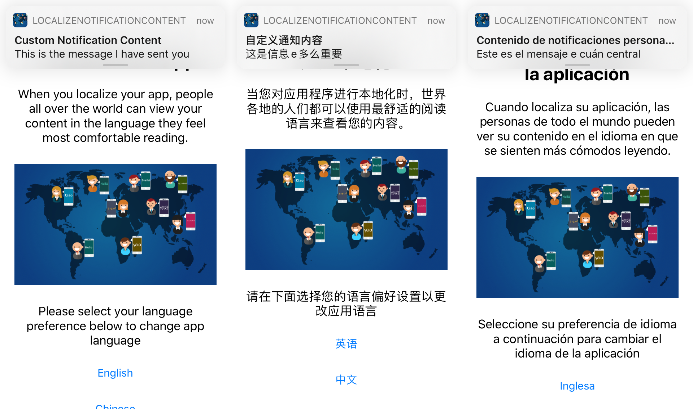

# LocalizeNotificationContent
Localizing iOS notification content based on your application language or device language.

## Features
1. Capability for Remote Notification receiving through FCM.
2. Capability to use App Groups.
3. Shared UserDefaults as app local storage.
4. Support for Internationalization.
5. Localize the app to support languages like Chinese(Simplified), English and Spanish.
6. Localize notification content based on current app language.
7. Localize notification content based on current device language.

## Capabilities Given to the app
1. Push Notification
2. App Groups

## App Extensions Used
Notification Service Extension

## Steps to Achieve
1. Make the app capable to receive APNS notifications from FCM(Firebase Cloud Messaging).
2. Make the app to support Internationalization using XCode.
3. Export the strings from storyboard and dynamic texts used programatically(from localizable.strings file) as .xliff files and import them back to the XCode after translation.
4. Change the language of app at runtime without app manual restart.
   - In iOS 13 or later, set app language with default device settings app in the iPhone without writing additional code.
   - For older iOS versions, use the combination of method swizzling and LanguageManager-iOS pod to force change the app language at runtime without app restart.
5. Create shared UserDefaults using App Groups.
6. Save current app language or device language in the shared UserDefaults.
7. Use Notification Service Extension to localize the notification message before shown to the user.

Please checkout my post [here](https://medium.com/@yureka_81375/localizing-ios-notification-content-based-on-your-application-language-or-device-language-4cb63f3a65fd) for your reference.

## Support
  - Twitter [@YurekaUnique](https://twitter.com/YurekaUnique)
  - LinkedIn [yurekamr](https://www.linkedin.com/in/yurekamr)
  - Medium [@yureka_81375](https://medium.com/@yureka_81375)
